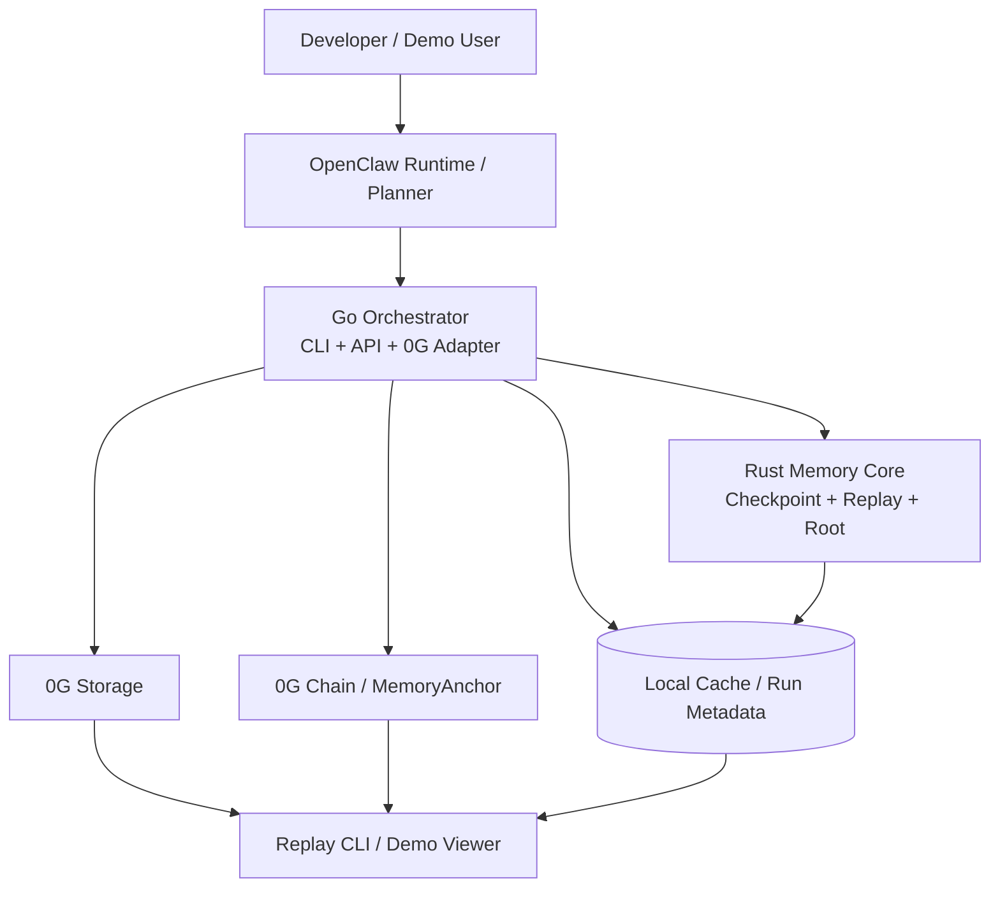
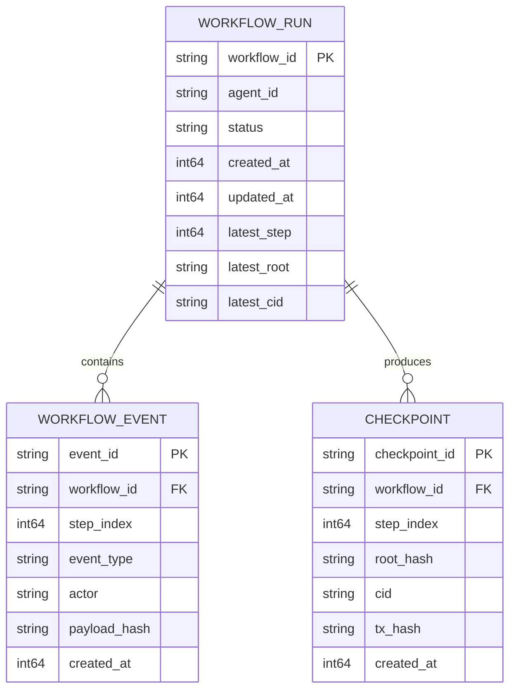

# 0G OpenClaw Memory Runtime Technical Design

## 1. Overview

0G OpenClaw Memory Runtime is a durable workflow memory layer for OpenClaw-style agent execution. It provides:

- persistent workflow checkpoints stored in 0G Storage
- verifiable checkpoint roots anchored on 0G Chain
- replay / resume for interrupted agent workflows
- task, tool-call, and summary traces for demo and debugging

The core design goal is to make AI workflow execution **recoverable, auditable, and demoable** for the AI Infra + OpenClaw track.

## 2. Goals and Non-Goals

### Goals
- Integrate with OpenClaw-style workflow execution events
- Persist every workflow step as a checkpoint to 0G Storage
- Anchor the latest checkpoint root + CID on 0G Chain
- Recover a workflow from the latest checkpoint
- Replay workflow execution for demo / judging
- Use Go for orchestration and 0G integration
- Use Rust for checkpointing, replay, and verifiable state transitions

### Non-Goals
- Full consumer product UI
- On-chain inference execution
- Sealed inference / TEE in MVP
- X402 billing and payment flows in MVP
- Production-grade auth / multi-tenant SaaS control plane

## 3. Product Positioning

### Track Fit
Primary track: **Agentic Infra + OpenClaw Lab**

### One-line Pitch
A verifiable memory runtime for OpenClaw workflows on 0G: every agent step is checkpointed to 0G Storage, anchored on-chain, and recoverable after failure.

### Why It Matters
Most agent demos lose state on restart, cannot prove execution history, and have weak failure recovery. This project turns workflow execution into a durable, auditable state machine.

## 4. Primary Personas

### Persona A: Infra Builder
- Wants a reusable runtime for agent orchestration
- Cares about recoverability, logs, determinism, and API boundaries

### Persona B: Hackathon Judge / Ecosystem Reviewer
- Wants clear evidence of 0G component usage
- Needs a 3-minute demo showing real storage + chain calls

### Persona C: Agent Framework Integrator
- Wants to plug OpenClaw or similar runtimes into durable memory primitives
- Needs a simple adapter contract and checkpoint API

## 5. MVP Scope

### MVP User Flow
1. Create workflow run
2. Receive workflow steps from OpenClaw adapter
3. For each step:
   - append event to state log
   - build checkpoint with Rust core
   - upload checkpoint blob to 0G Storage
   - anchor root + CID to chain
4. Interrupt execution
5. Resume from last checkpoint
6. Replay the full execution trace

### MVP Deliverables
- Go orchestrator CLI/API
- Rust memory-core service/library
- 0G Storage integration
- 0G Chain anchor contract + integration
- OpenClaw adapter interface
- Demo replay command or web viewer
- Clean README and demo script

## 6. High-Level Architecture



## 7. Container-Level Design

### 7.1 Go Orchestrator
Responsibilities:
- own CLI and optional HTTP API
- accept workflow events from OpenClaw
- call Rust core to update workflow state
- upload checkpoint blobs to 0G Storage
- anchor checkpoint metadata on chain
- expose replay/resume commands

### 7.2 Rust Memory Core
Responsibilities:
- maintain workflow event log
- build deterministic checkpoint snapshots
- calculate root hash / Merkle-like digest
- replay a workflow from checkpoint + events
- compact state for storage efficiency

### 7.3 0G Storage Layer
Responsibilities:
- store checkpoint blobs
- store trace artifacts and final summaries
- return CIDs for all persisted artifacts

### 7.4 0G Chain Layer
Responsibilities:
- store workflow checkpoint anchors
- map workflow_id => latest root/cid/step
- provide verifiable public audit trail

## 8. Data Model



## 9. Suggested Repository Layout

```text
apps/
  orchestrator-go/
    cmd/
    internal/openclaw/
    internal/workflow/
    internal/checkpoints/
    internal/ogstorage/
    internal/ogchain/
    internal/replay/
    internal/server/
    internal/config/
    pkg/types/
rust/
  memory-core/
    src/lib.rs
    src/workflow_state.rs
    src/event_log.rs
    src/checkpoint.rs
    src/merkle.rs
    src/replay.rs
    src/rpc.rs
contracts/
  MemoryAnchor.sol
```

## 10. Key Interfaces

### 10.1 OpenClaw → Go
Input event schema:
- workflow_id
- agent_id
- step_index
- event_type
- tool_name (optional)
- input/output payload
- timestamp

### 10.2 Go → Rust
Recommended MVP protocol:
- local subprocess + JSON over stdin/stdout

Commands:
- `init_workflow`
- `append_event`
- `build_checkpoint`
- `resume_from_checkpoint`
- `replay_workflow`

### 10.3 Go → 0G Storage
Operations:
- `upload(checkpoint_blob)`
- `download(cid)`
- `upload(trace_blob)`

### 10.4 Go → 0G Chain
Operations:
- `anchorCheckpoint(workflowId, stepIndex, rootHash, cid)`
- `getLatestCheckpoint(workflowId)`
- `getCheckpointHistory(workflowId)`

## 11. Contract Design

Suggested contract: `MemoryAnchor.sol`

State:
- `latestCheckpoint[workflowId]`
- `checkpointHistory[workflowId]`

Anchor record fields:
- workflowId
- stepIndex
- rootHash
- cidHash / cid
- timestamp
- submitter

Why new contract instead of current `MemoryChain`:
- current contract is wallet-centric
- MVP needs workflow-centric anchoring
- workflow id and checkpoint step are first-class concepts

## 12. Demo Narrative

### Demo Sequence
1. Start workflow run
2. Emit 3 workflow steps from OpenClaw adapter
3. Show checkpoint creation after each step
4. Show real 0G Storage upload and returned CID
5. Show chain anchor transaction and explorer link
6. Kill process or simulate interruption
7. Resume from latest checkpoint
8. Replay the full trace

### Judge-visible Proofs
- 0G Storage RPC calls
- returned CIDs
- 0G Chain tx hash + explorer link
- replay output matching earlier steps

## 13. Non-Functional Requirements

### Reliability
- No workflow step is marked committed until storage + local metadata are updated
- Resume from latest committed checkpoint after crash

### Verifiability
- Every checkpoint has deterministic root hash
- Chain anchor references the same checkpoint blob stored in 0G

### Observability
- structured logs for workflow_id, step_index, cid, tx_hash
- replay output suitable for demo recording

### Performance
- MVP target: 3-10 steps per demo run
- stretch: batched checkpoints or async anchoring

## 14. Risks and Mitigations

### Risk: Overbuilding around OpenClaw internals
Mitigation: define a thin adapter contract; do not tightly couple to a changing upstream API

### Risk: Cross-language integration complexity
Mitigation: use subprocess JSON protocol first; avoid CGO for MVP

### Risk: 0G API semantics drift or unstable assumptions
Mitigation: treat storage and chain adapters as isolated modules with integration tests and mocked fallbacks

### Risk: Demo breaks under live RPC issues
Mitigation: prepare deterministic recorded artifacts + fallback testnet script

## 15. Milestones

### Milestone 1: Foundation
- clean repo structure
- fix current Go test/build issues
- stabilize 0G adapters

### Milestone 2: Durable Workflow Runtime
- Rust checkpoint core
- Go orchestrator integration
- local replay/resume

### Milestone 3: On-Chain Proof
- workflow-centric contract
- chain anchor flow
- explorer proof links

### Milestone 4: Demo Readiness
- replay CLI or web viewer
- README, architecture diagram, demo script, submission assets

## 16. Open Questions
- Which exact OpenClaw event format should the adapter target first?
- Should checkpoint anchoring happen synchronously per step or asynchronously with commit queue?
- Is the demo viewer CLI-first or minimal web-first?
